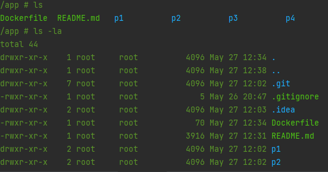
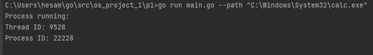
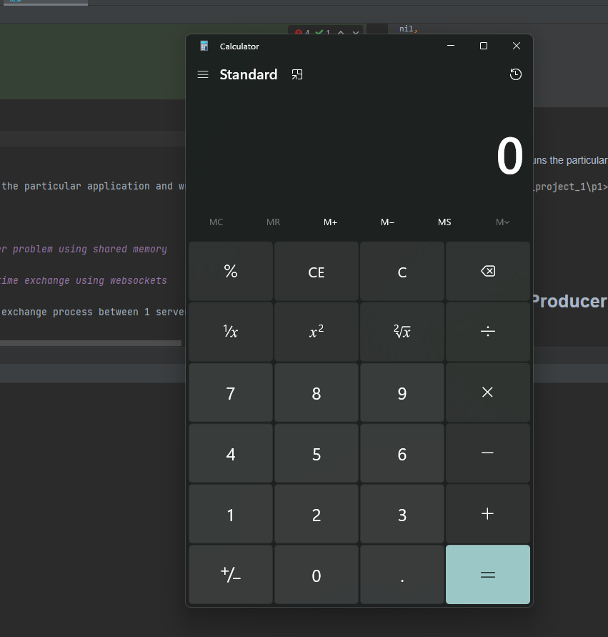
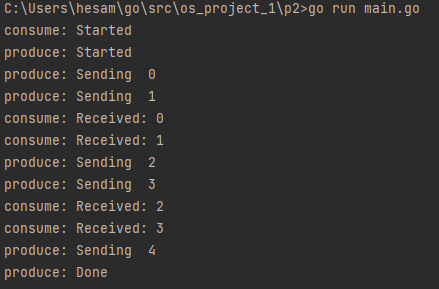
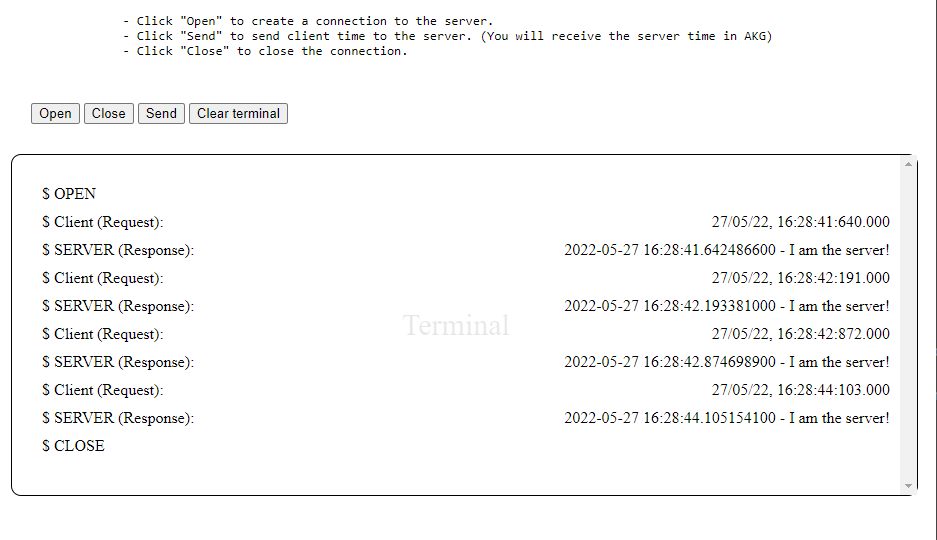
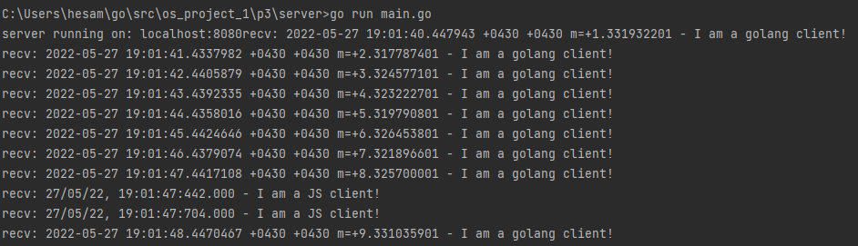
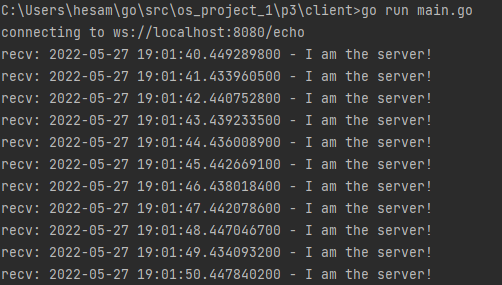
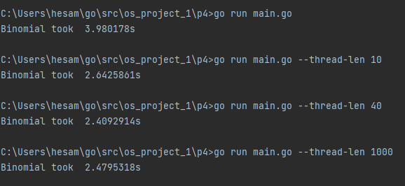

# OS Project 1

This folder contains the solutions for project 1, ***OS course at Amirkabir university of technology***.

The documentation contains some instructions needed to run the applications and also funder explanation about the
results.

Note that:

- All solutions are implemented using [golang](https://go.dev/). You can use [This](https://go.dev/dl/) link to download
  and install this language on your machine to be able to run these codes.
- [P1](./p1) is using Windows API system call. So you need to run that on a Windows machine.
- For your ease, I provided a dockerfile. If you have docker installed, by running these steps you can run all
  applications on your system **without installing golang**:
    - Using this method, you will not be able to run [p1](./p1).
      (Because we used a Linux golang image, and we couldn't use a Windows golang image because normally docker is only
      able to run linux based images.)
    - In the root directory run these commands:

      ```shell
      docker build -t os_project_1 .
      
      docker run -it --rm --name ps_project_1_instance os_project_1      
      ```
    - Now you are interacting with a terminal running on a virtual machine. (You can continue running all other steps in
      here)

      

    - To connect more terminals to this virtual machine run:

    ```shell
    docker exec -it ps_project_1_instance sh
    ```

## Credits

Group members:
> - **Hesam Sarkhosh** - 9713020
> - **Shiva Moloodi** - 9713031
> - **Amirmohammad Saremi** - 9713051

## Index

This project contains the solution to 4 problems:

1. [Run another process using Windows API System call](#problem-1---run-another-process-using-windows-api-system-call)
2. [The Producer-consumer problem using shared memory](#problem-2---the-producer-consumer-problem-using-shared-memory)
3. [Client-server  Datetime exchange using websockets ](#problem-3---client-server--datetime-exchange-using-websockets)
4. [Multithreading matrix addition](#problem-4---multithreading-matrix-addition)

## Problem 1 - Run another process using Windows API System call

This program runs a new process using Windows API syscall.

### How to run it?

Follow these steps:

```shell
cd ./p1
go run ./main.go

# This app runs the windows **calculator** on default.
# So if you want to run other executables just pass it using --path flag.

# Example:
go run main.go --path "C:\Windows\System32\wsl.exe"
```

### How it works?

- This program uses `syscall` built-in golang library which uses an API to execute system calls.

```go
// p1/main.go
func main() {
// ...
err = syscall.CreateProcess(
nil,
argv,
nil,
nil,
true,
0,
nil,
nil,
&sI,
&pI)
//...
}

```

### Results

- As the result, this program runs the particular application and writes `ThreadID` and `ProcessID` to the console.





## Problem 2 - The Producer-consumer problem using shared memory

This program solves a Producer-consumer problem using shared memory.

### How to run it?

```shell
cd ./p2

go run ./main.go 

# Flags:
# Use --cpuprofile to specify a file name to write cpu profile
# Use --memprofile  to specify a file name to write memory profile
# Use -n  to specify number of messages being transferred. Default is 5.
# As default they are not being written to file
go run main.go -n 20 --cpuprofile cpu.prof --memprofile mem.prof

```

### How it works

- The consumer and consume:

```go
//p2/main.go

//...
type Consumer struct {
msgs *chan int
}

// NewConsumer creates a Consumer
func NewConsumer(msgs *chan int) *Consumer {
return &Consumer{msgs: msgs}
}

// consume reads the msgs channel
func (c *Consumer) consume() {
fmt.Println("consume: Started")
for {
msg := <-*c.msgs
fmt.Println("consume: Received:", msg)
}
}
//...
```

- The producer and produce:

```go
//p2/main.go

//...
// Producer definition
type Producer struct {
msgs *chan int
done *chan bool
}

// NewProducer creates a Producer
func NewProducer(msgs *chan int, done *chan bool) *Producer {
return &Producer{msgs: msgs, done: done}
}

// produce creates and sends the message through msgs channel
func (p *Producer) produce(max int) {
fmt.Println("produce: Started")
for i := 0; i < max; i++ {
fmt.Println("produce: Sending ", i)
*p.msgs <- i
}
*p.done <- true // signal when done
fmt.Println("produce: Done")
}
//...
```

- Parsing the flags:

```go
//p2/main.go

//...
cpuprofile := flag.String("cpuprofile", "", "write cpu profile to `file`")
memprofile := flag.String("memprofile", "", "write memory profile to `file`")

// get the maximum number of messages from flags
max := flag.Int("n", 5, "defines the number of messages")

flag.Parse()
//...
```

- Making sure that CPU resources are not being limited by default:

```go
//p2/main.go

//...

// utilize the max num of cores available
runtime.GOMAXPROCS(runtime.NumCPU())

//...

```

- Running both sides:

```go
//p2/main.go

//...

// Start a goroutine for Produce.produce
go NewProducer(&msgs, &done).produce(*max)

// Start a goroutine for Consumer.consume
go NewConsumer(&msgs).consume()

// Finish the program when the production is done
<-done

//...
```

- Creating profiles:

```go
//p2/main.go

//...

// CPU Profile
if *cpuprofile != "" {
f, err := os.Create(*cpuprofile)
if err != nil {
log.Fatal("could not create CPU profile: ", err)
}
if err := pprof.StartCPUProfile(f); err != nil {
log.Fatal("could not start CPU profile: ", err)
}
defer pprof.StopCPUProfile()
}

//...

// Memory Profile
if *memprofile != "" {
f, err := os.Create(*memprofile)
if err != nil {
log.Fatal("could not create memory profile: ", err)
}
runtime.GC() // get up-to-date statistics
if err := pprof.WriteHeapProfile(f); err != nil {
log.Fatal("could not write memory profile: ", err)
}
f.Close()
}

//...


```

### Results



- Note that the program finishes when the **production** is done.

## Problem 3 - Client-server  Datetime exchange using websockets

This implementation shows the time exchange process between 1 server and 2 clients using websockets.

### This program has 3 parts:

1. The golang server.


2. The front-end Javascript client that you can access on
   http://127.0.0.1:8080.


3. The golang client.

### How to run them?

To run the server and the front-end JS client:

```shell
cd ./p3/server
go get github.com/gorilla/websocket
go run ./main.go
# if you want to run it on other ports you can use --addr flag:
# go run ./main.go --addr localhost:8070
```

After running the server, start the client:

```shell
cd ./p3/client
go get github.com/gorilla/websocket
go run ./main.go

#Note that you can't start golang client before running the server. Also, after halting the server the golang client halts automatically.
```

### How they work?

- The server sends its current time to the clients.

- The golang client sends its current time every second and prints all messages received.

- The JS client sends its current time when you push "send" button and server in response returns his own time.

- The server and golang client use `gorilla/websocket` to create websocket connections.

```go
// p3/server/main.go
//...
var upgrader = websocket.Upgrader{} // use default options
func echo(w http.ResponseWriter, r *http.Request) {
c, err := upgrader.Upgrade(w, r, nil)
//...
}
//...
```

- The server and golang client use `net/http` package to establish http connection.

```go
// p3/server/main.go
//...
func main() {
//...
http.HandleFunc("/echo", echo)
http.HandleFunc("/", home)
log.Fatal(http.ListenAndServe(*addr, nil))
}
//...
```

- The server uses `html/template` to render [index.html](./p3/server/index.html) front-end Js client on
  http://127.0.0.1:8080.

```go
// p3/server/main.go
//...
var homeTemplate = template.Must(template.New("").Parse((func () string {
result, err := ioutil.ReadFile("index.html")

if err != nil {
log.Fatal(err)
return ""
}

return string(result)

})()))
```

### Results

- After running the [p3/server](p3/server/main.go), you can navigate to http://localhost:8080 to see this page:



- After running the [p3/server](p3/server/main.go), you can observe the times sent by all clients to the server.



- After running the [p3/server](p3/server/main.go) and [p3/client](p3/client/main.go), you can see all the messages sent
  to this client from the server. (The current time of the server)



## Problem 4 - Multithreading matrix addition

This program implements the functionality of adding two randomly generated **N * N** matrices, using concurrency.

### One Important point

You should note that unlike any other programming language, Golang supports built-in functionality for multithreading
and concurrency.

This means that we can't access any API to execute system calls based on the OS, but golang gives us a much better
functionality!

Golang uses concepts like `Go routine` and `channel` which basically is equivalent to `coroutine` and `Pipeline`.

### How it works?

- At the binging 2 random N x N matrices are being generated.

```go
// p4/main.go

//...
func main(){
//...
var a [length][length]int
var b [length][length]int
for i := 0; i < length; i++ {
for j := 0; j < length; j++ {
a[i][j] = rand.Intn(10)
b[i][j] = rand.Intn(10)
}
}
//...

}
```

- To change the dimensions of matrices you can change `length` constant inside the code (That's a compile-time constant,
  so we couldn't use flags to specify that dynamically).

```go

const length = <any value you want> //default is 1000

```

- In this program we use a particular number of producers (That number is interchangeable) which write on a channel with
  the length 10. (We didn't use longer channel because the overhead of creating such channel consumes much more time,
  and it's not efficient to do so. Because the consumer is much faster than producers and 10 is enough to guaranty that
  producers are not going to stand in a queue for too long.)
- In addition to that, one consumer reads the results from the channel. (One is enough because we need to sync the
  results and reading data from channel consumes much less time than calculating the sum)

```go
// p4/main.go

//...
func main() {
// ...

// 
pairs := make(chan pair, 10)

var wg sync.WaitGroup

//...

// Used to sync the final results
wg.Add(getThreadLength())

// Run producers to calculate sum of each pair
for i := 0; i < getThreadLength(); i++ {
go Calc(pairs, &a, &b, &rez, &wg)
}


// To track the time, timer starts:
start = time.Now()

// Running the one and only receiver or consumer
for i := 0; i < length; i++ {
for j := 0; j < length; j++ {
pairs <- pair{row: i, col: j}
}
}
close(pairs)
// Used to sync the final results
wg.Wait()

// To track the time, timer ends:
elapsed := time.Since(start)

// Printing the Timer result:
fmt.Println("Binomial took ", elapsed)

}


```

- As default the program uses 1 goroutine as calculator or producer, Which means it runs in single thread mode.
- To run the program using all threads the number of go routines must be more than kernel threads. You can
  use `--thread-len` flag to specify the number of `goroutines`
  being used. (see more in How to run section.)


- This command guarantees that the max-number of kernel threads being used is set to the maximum number available, to
  prevent OS from limiting the resources:

```go
    runtime.GOMAXPROCS(runtime.NumCPU())
```

### How to run it?

Follow these steps:

```shell
cd ./p4

# Run in single thread mode:
go run ./main.go 

# To set the number of goroutines (producers) use --thread-len. Default is 1 (Single thread).
go run ./main.go --thread-len 10
```

### Result

After running the program, you can see the time it took to compute the final matrix.

- I didn't print the result matrix because there was no point in printing a random matrix.



> - As you can see, increasing the number of goroutines does not always provide better results. For example when we used 1000 goroutines, the overhead of handling the concurrency was more expensive than the improvement we got.
